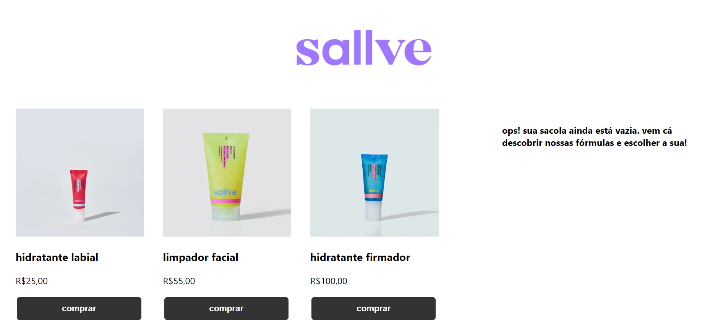
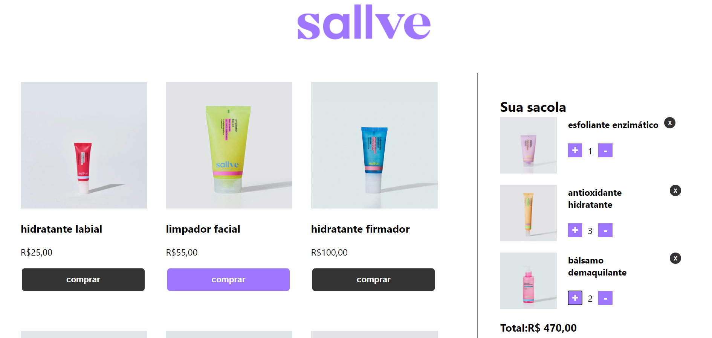

# Sallve Store

## Índice

* [1. Resumo do projeto](#2-resumo-do-projeto)
* [2. Interface](#2-interface)
* [3. Rodar Aplicação](#3-rodar-aplicação)
* [4. Tecnologias utilizadas](#4-Tecnologias-utilizadas)

***

## 1. Resumo do projeto

Criar um carrinho de compras onde o usuário possa inserir, deletar produtos, visualizar a quantidade de itens e valor total da compra.

## 2. Interface

Interface criada para visualização em tablet.

## 3. Rodar Aplicação

Para rodar essa aplicação, você precisará instalar [npm](https://www.npmjs.com/).

Uma vez com o npm instalado e o repositório clonado, acesse o diretório do repositório e digite o seguinte comando para instalar as dependências desse projeto:

`npm install`

Para rodar a aplicação:

`npm start`

A aplicação rodará na porta 3000 http://localhost:3000/

***

## 4. Tecnologias utilizadas 

* JavaScript
* React
* Axios
* NodeJs
* Nodemon
* MariaDb
* Sequelize
* Express
* Git e Github

